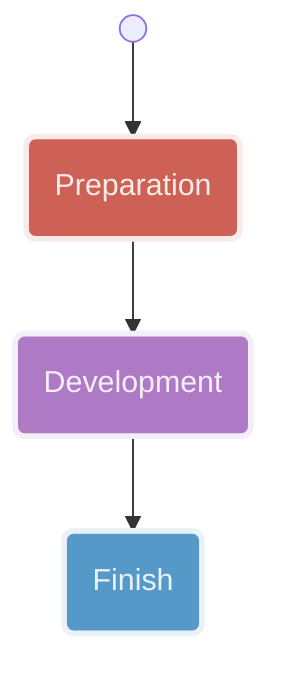
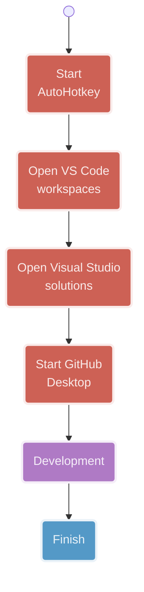
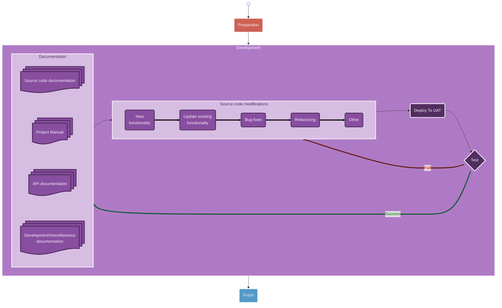

<!-- u250602 -->

<!--
  I'm sure the Mermaid.js code here looks awful, but it was a real pain to get
  all it looking the way it does, so I don't plan on touching it going forward.

  The rest of the document will be updated normally.
-->

# Daily workflow

This is the daily workflow for all Tingen projects.

## Preparation

## Development

