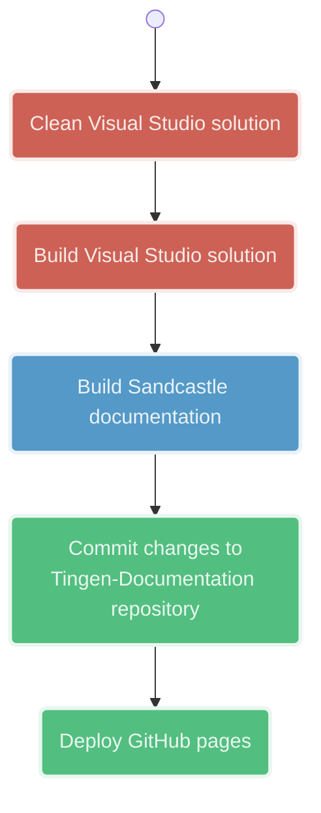
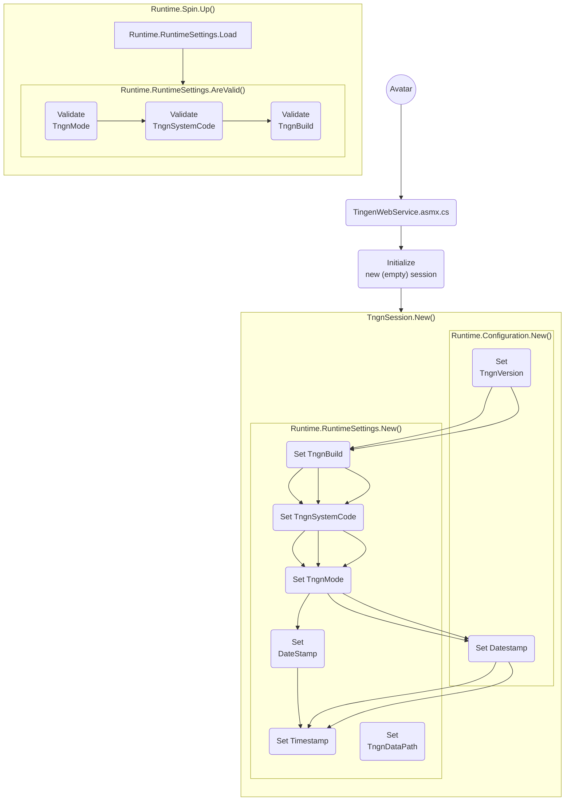

<!-- u250530 -->

<!--
  I'm sure the Mermaid.js code here looks awful, but it was a real pain to get
  all it looking the way it does, so I don't plan on touching it going forward.

  The rest of the document will be updated normally.
-->

[View [Markdown version](https://github.com/spectrum-health-systems/tingen-documentation/blob/main/docs/development/workflows.md)]

# Workflows

[Sandcastle/GitHub Pages](#sandcastlegithub-pages)
[Tingen Web Service](#tingen-web-service)

## Sandcastle/GitHub pages

***

# Tingen Web Service

