<!-- u250818 -->

[[🏠︎](/README.md)] ❬ [Tingen Manuals](../README.md) ❬ [Tingen Web Service Manual](./README.md)

  

## Hosting the Tingen Web Service using Microsoft IIS

***

### CONTENTS

* [Overview](#overview)
* [Installing IIS](#installing-iis)
* [Setting up IIS](#setting-up-iis)
* [Hosting the Tingen Web Service using IIS]()

***

# Overview

In order to use any web service that interfaces with myAvatar™, that web service needs to be ***hosted*** at a location that myAvatar™ has access to

There are two options for hosting a custom web service:

1. **Have Netsmart host your custom web service** 
If your myAvatar™ environments are hosted by Netsmart, they can also host your custom web services. If you choose to have Netsmart host your custom web service, you can skip the rest of this document and contact them to set things up.

2. **Self-host your custom web service** 
If you self-host your myAvatar™ environments, or would rather have complete control over your custom web services, you can self-host them. This document will walk you through the process of doing that.

## Using Microsoft IIS to host a custom web service

You can probably host your custom web service using many web server/operating systems combinations, but these guidelines will focus on getting setup on Microsoft IIS.

These are the steps that I use to host a the Tingen Web Service, but they are more of a *guideline* than a perfect set of instructions. It's quite possible that I didn't follow best-practices, or maybe I have something setup incorrectly, so please use caution when following these steps.

## PLEASE NOTE

* This document assumes that you already have a IIS up and running.
* Keep in mind that myAvatar™ can only communicate with web services via the *HTTPS* protocol.

# Installing Microsoft IIS

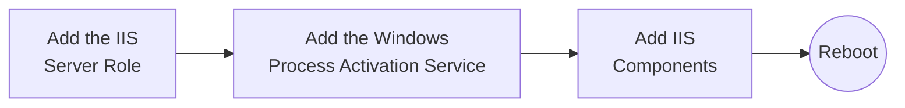

1. Launch the **Server Manager** application

2. Under **Server Roles**, check the box next to **Web Server (IIS)**

  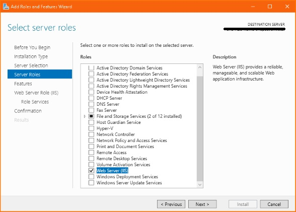

2. If a popup suggests you include the *IIS Mangement Console* tools, checked, then click ***Add Features***

  

3. Under **Features**, add the **Windows Process Activation Service**

  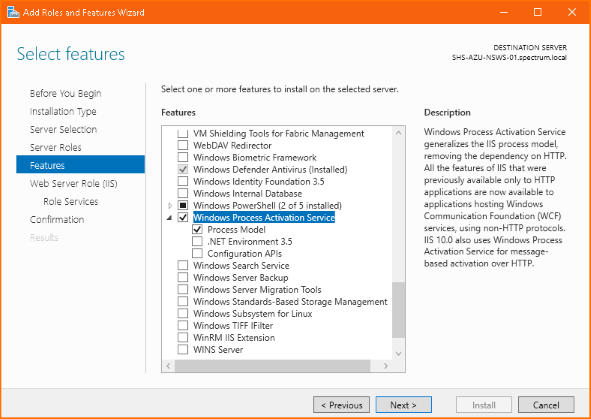

4. Under **Web Server Role (IIS) > Role Services**, verify that the components highlighted green are set properly

  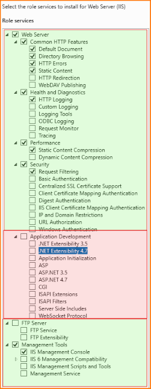

4. Under **Web Server Role (IIS) > Role Services**, check **Application Development**

  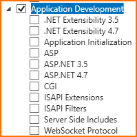

5. In the **Application Development** section, check the following *in this order*:

* **ISAPI Filters**
* **ISAPI Extensions**
* **.NET Extensibility 4.7**
* **ASP.NET 4.7**

  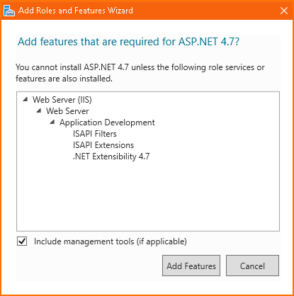

> If you didn't follow the order above, you may get a popup letting you know that required features are missing. Just click ***Add Features***, and continue.

6. Click ***Next***, and you should see the confirmation screen:

  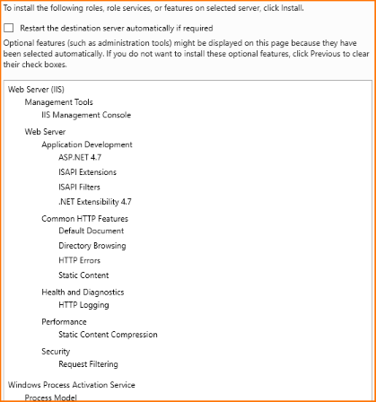

7. Click ***Install***

8. Once the installation is complete, click ***Close***

## Reboot

If you checked the *Restart the destination server automatically if required* box on the confirmation screen, the server should reboot automatically.

If the server does not reboot automatically, reboot manually.

# Setting up IIS

This is what a fresh installation of IIS should look like:

  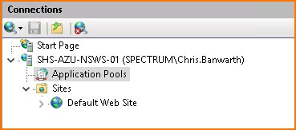

## Applications Pools

### Disabling the current Application Pools

Since we are going to be creating a new Application Pool, we can disable those that were installed with IIS.

  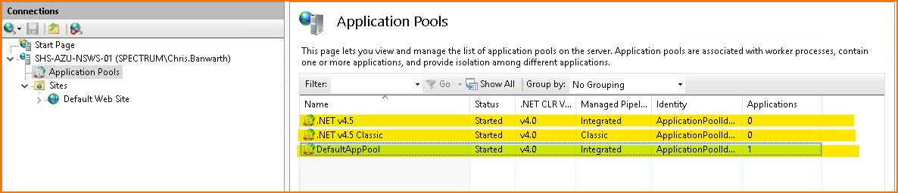

To do this, **right click** on the following Application Pools (hightlighted yellow), then choose **Stop**

* .NET v4.5
* .NET v4.5 Classic
* DefaultAppPool

The Application Pools should now look like this:

  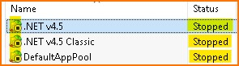

### Creating an new Application Pool

From within IIS:

1. Right-click the **Application Pools** connection
2. Choose **Add Application Pool…**
3. Name the Application Pool `Tingen_WebService`
4. Verify everything looks like this:

  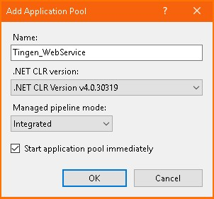

5. Click ***OK***
6. Verify that the new Application Pool is listed, and has started:

  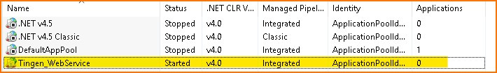

# Sites

# Disabling the current site

Since we are going to be creating a new Site, we can disable default site that was installed with IIS.

  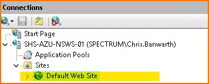

To do this:

1. **Right click** on the *`Default Web Site* (hightlighted yellow)
2. Choose **Manage Website**
3. Choose **Stop**

The Default Web Site should now look like this:

  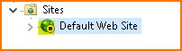

## Creating a new site

From within IIS:
1. Right-click the **Sites** connection
2. Choose **Add Website**
3. The **Site name** should be: *AvatoolWebService*
4. The **Application pool** should be: *AvatoolWebService*
5. The **Physical path** should be: */path/to/your/files/*
6. In the **Binding > Type** dropdown, choose ***https***
7. Click the **Select...** button, and choose a valid certificate to use

This is what the Add Website window should look like:

  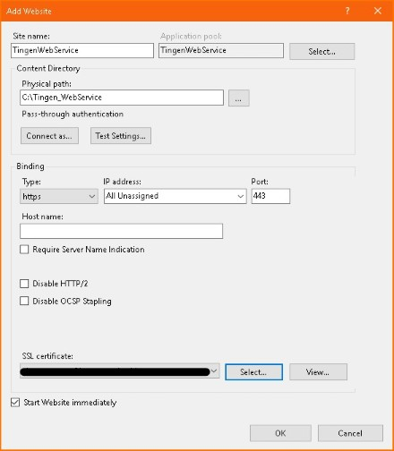

8. Click **OK**, and the ***Sites*** tree should look like this:

  

## Adding directories for LIVE and UAT

# Configuring the new TingenWebService site

We'll want to make sure that we are in the TingenWebService site when configuring:

  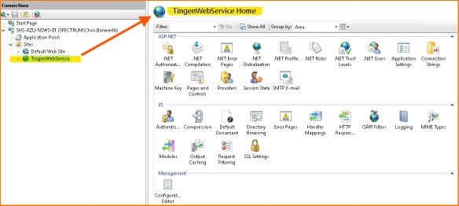

## Enable directory Browsing

In the TingenWebService Home:

1. Double-click on the **Directory Browsing** icon:

  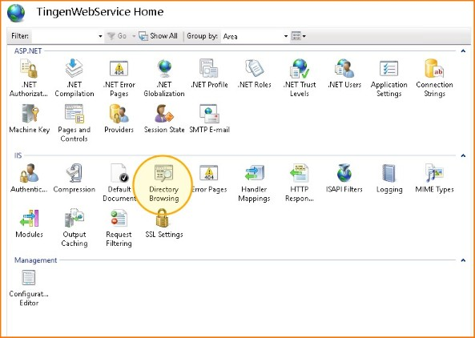

On the right-hand side under **Actions**, click **Enable**

  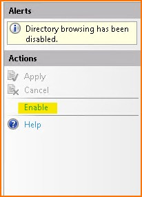

2. Click **Enable**

The browsing functionality should now look like this:

  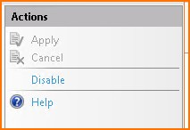

## Enable SSL

In the TingenWebService Home:

1. Double-click on the **SSL Settings** icon:

  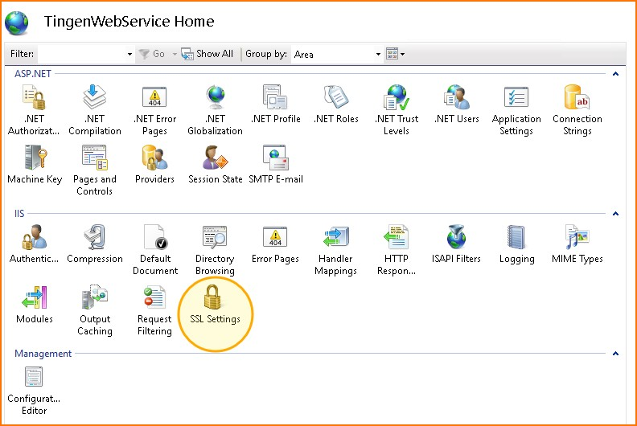

2. Check the **Require SSL** box
3. On the right-hand side under **Actions**, click **Apply**

  

The SSL Settings should now look like this:

  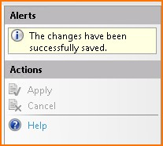

## Verifying the new site

Your AvatoolWebService site should look like this:

<h6 align="center">

  
   
  Maybe?
   

</h6>

At this point, you should be able to point a browser to your website, and see the landing page.

 

***

[[🏠︎](/README.md)] ❬ [Tingen Manuals](../README.md) ❬ [Tingen DevDeploy Manual](./README.md)