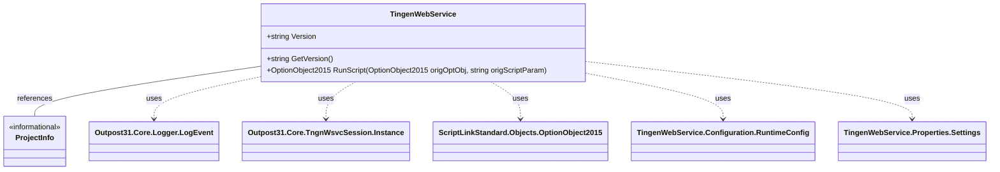

```mermaid
classDiagram
    class TingenWebService {
        +string Version
        +string GetVersion()
        +OptionObject2015 RunScript(OptionObject2015 origOptObj, string origScriptParam)
    }
    class ProjectInfo {
        <<informational>>
    }
    TingenWebService -- ProjectInfo : references
    TingenWebService ..> Outpost31.Core.Logger.LogEvent : uses
    TingenWebService ..> Outpost31.Core.TngnWsvcSession.Instance : uses
    TingenWebService ..> ScriptLinkStandard.Objects.OptionObject2015 : uses
    TingenWebService ..> TingenWebService.Configuration.RuntimeConfig : uses
    TingenWebService ..> TingenWebService.Properties.Settings : uses
```