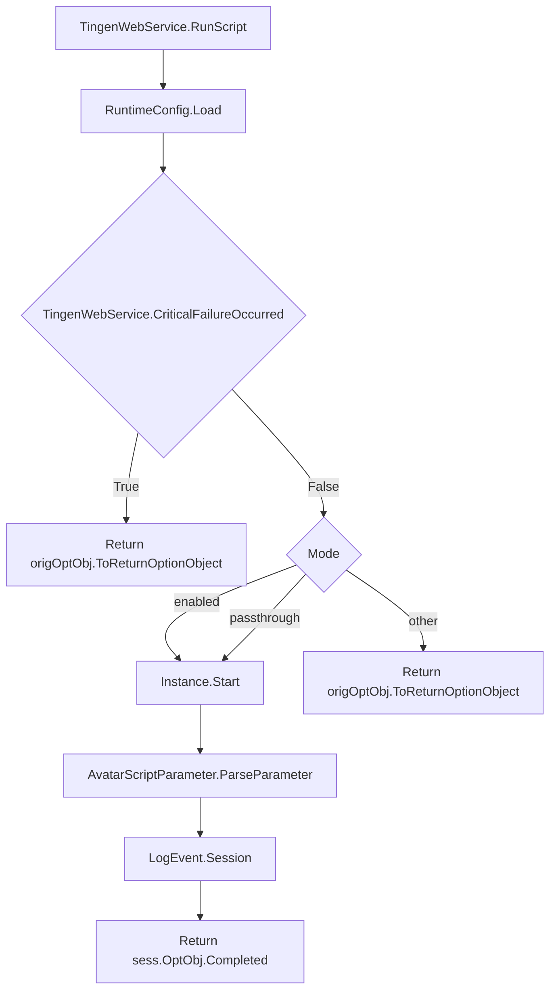

<!-- u250924 -->

[[🏠︎](../../README.md)] ❬ [Static](../README.md) ❬ [Diagram](README.md)

# TingenWebService.asmx.cs

## CriticalErrorOccurred()

```mermaid
flowchart TD
    A[TingenWebService.RunScript] --> B[RuntimeConfig.Load]
    B --> C{TingenWebService.CriticalFailureOccurred}
    C -- True --> D[Return origOptObj.ToReturnOptionObject]
    C -- False --> E{Mode}
    E -- enabled --> F[Instance.Start]
    E -- passthrough --> F
    E -- other --> J[Return origOptObj.ToReturnOptionObject]
    F --> G[AvatarScriptParameter.ParseParameter]
    G --> H[LogEvent.Session]
    H --> I[Return sess.OptObj.Completed]
```