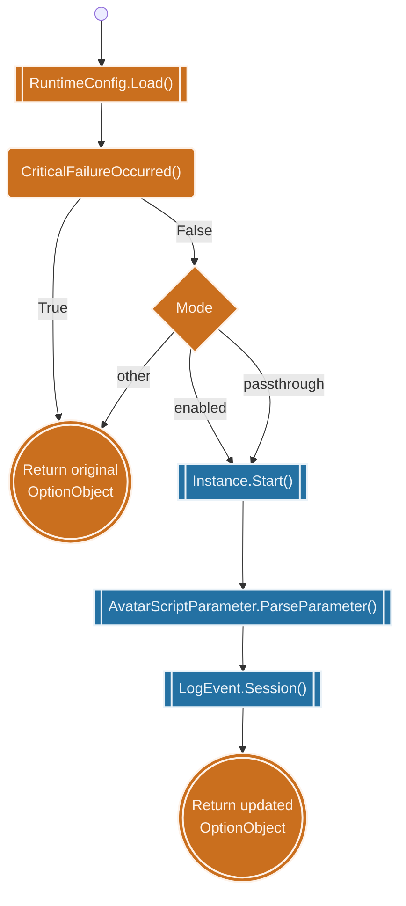
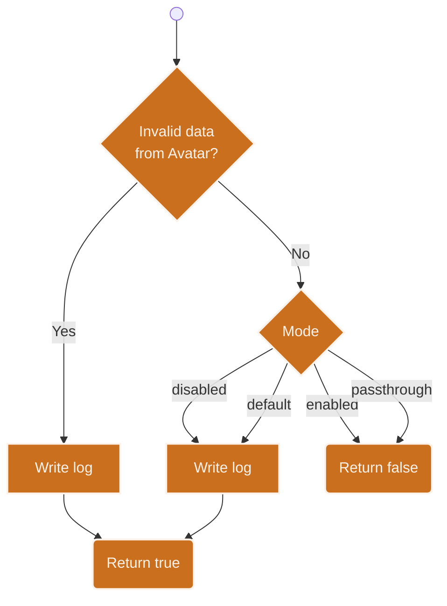

<!-- u250924 -->

[[🏠︎](../../README.md)] ❬ [Static documentation](../README.md) ❬ [Diagrams](README.md)

  <picture>
    <source media="(prefers-color-scheme: dark)" srcset="https://github.com/spectrum-health-systems/tingen-projects/blob/main/logos/tngndocs-dark-400x63.png">
    <source media="(prefers-color-scheme: light)" srcset="https://github.com/spectrum-health-systems/tingen-projects/blob/main/logos/tngndocs-light-400x63.png">
    
  </picture>
  <h1>
    Diagram ❱ TingenWebService
  </h1>

### CONTENTS

* asmx.cs
    * [GetVersion()](#getversion)
    * [RunScript()](#runscript)
    * [CriticalFailureOccurred()](#criticalfailureoccurred)

***

## GetVersion()

> Last updated 9/24/25

## RunScript()

> Last updated 9/24/25

## CriticalFailureOccurred()

> Last updated 9/25/25

***

[[🏠︎](../../README.md)] ❬ [Static documentation](../README.md) ❬ [Diagrams](README.md)