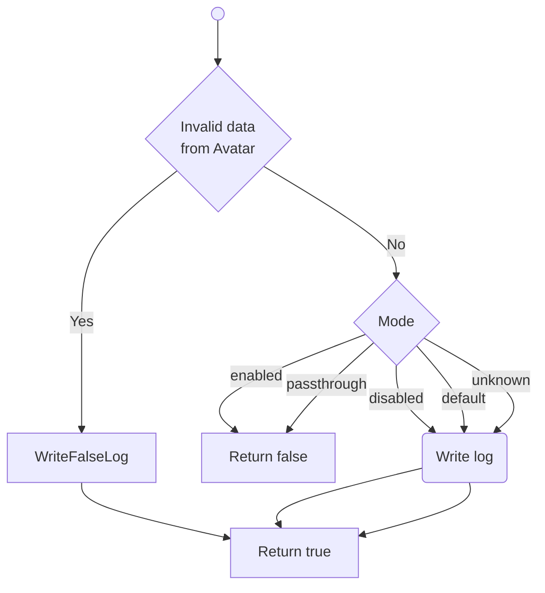

<!-- u250924 -->

[[🏠︎](../../README.md)] ❬ [Static documentation](../README.md) ❬ [Diagrams](README.md)

# TingenWebService

### CONTENTS

* asmx.cs
    * [GetVersion()](#getversion)
    * [RunScript()](#runscript)
    * [CriticalFailureOccurred()](#criticalfailureoccurred)

***

## GetVersion()

> Last updated 9/24/25

## RunScript()

> Last updated 9/24/25

## CriticalFailureOccurred()

> Last updated 9/24/25

***

[[🏠︎](../../README.md)] ❬ [Static documentation](../README.md) ❬ [Diagrams](README.md)