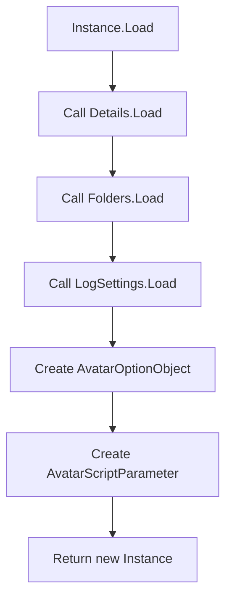
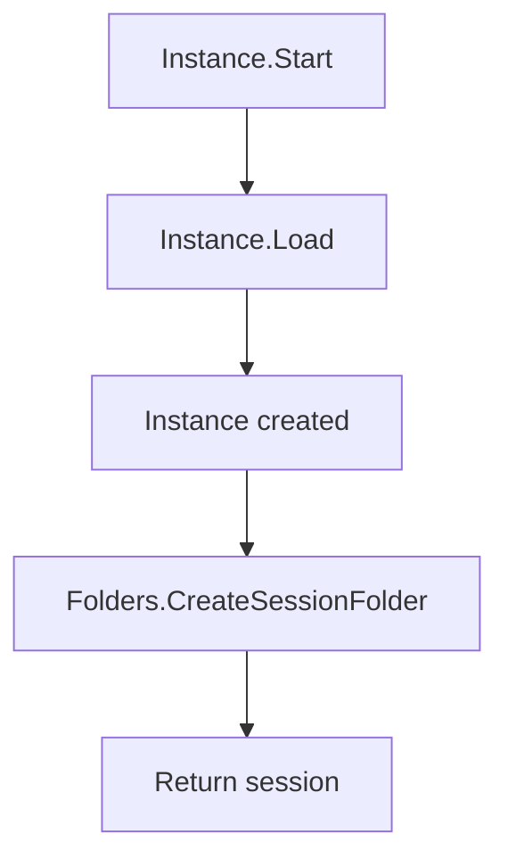

<!-- u250924 -->

[[🏠︎](../../README.md)] ❬ [Static documentation](../README.md) ❬ [Diagrams](README.md)

# Outpost31.TngnWsvcSession

### CONTENTS

* Instance.cs  
  * [Instance.Load()](#instanceload)  
  * [Instance Start()](#instancestart)  
* Detail.cs  
  * [Detail.Load()](#detailload)
  
***

# Instance.cs

## Instance.Load()

> Last updated 250924



## Instance.Start()

> Last updated 250924



# Detail.cs

## Detail.Load()

> Last updated 250924

```mermaid
flowchart TD
    A[Details.Load] --> B[Get current date (yyMMdd)]
    B --> C[Get current time (HHmmss)]
    C --> D[Set Version]
    D --> E[Set Mode]
    E --> F[Set AvatarSystem]
    F --> G[Set AvatarUserName]
    G --> H[Set RunningLog]
    H --> I[Return new Details object]
```
