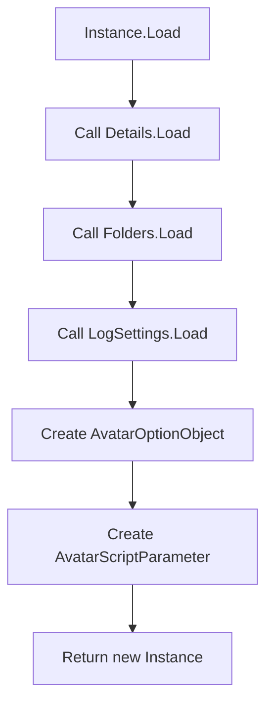
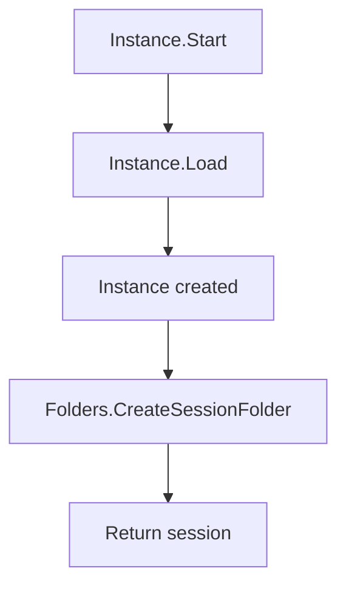
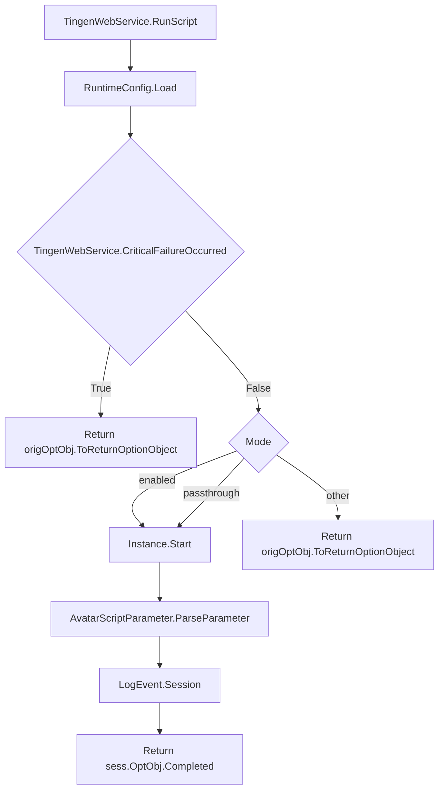
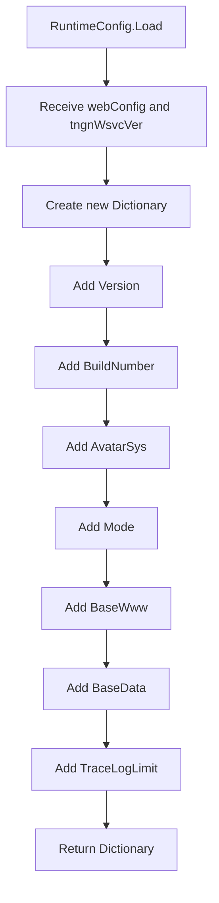

<!-- u250924 -->

[[🏠︎](../../README.md)] ❬ [Static documentation](../README.md) ❬ [Diagrams](README.md)

# Outpost31.TngnWsvcSession

### CONTENTS
[Outpost31.TngnWsvcSession.Instance.Load](#instanceload)  
[TingenWebService.Configuration.RuntimeConfig.cs](#tingenwebserviceconfigurationruntimeconfigcs)  

***

# Instance.Load()

> Last updated 250924

# Instance.Load()

> Last updated 250924

## TingenWebService.asmx.cs

> Last updated 250924

## TingenWebService.Configuration.RuntimeConfig.cs

> Last updated 250924

***

[[🏠︎](../../README.md)] ❬ [Static documentation](../README.md) ❬ [Diagrams](README.md)
