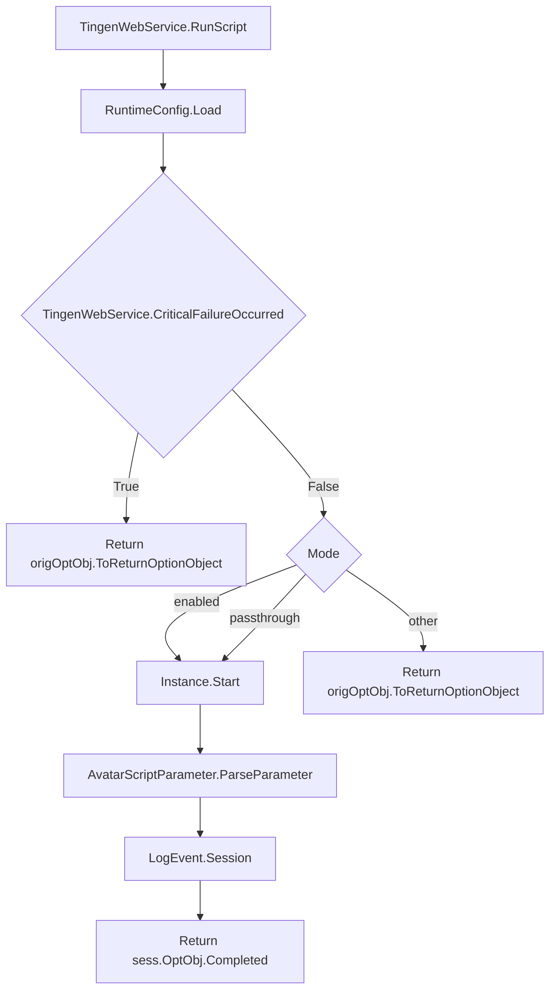
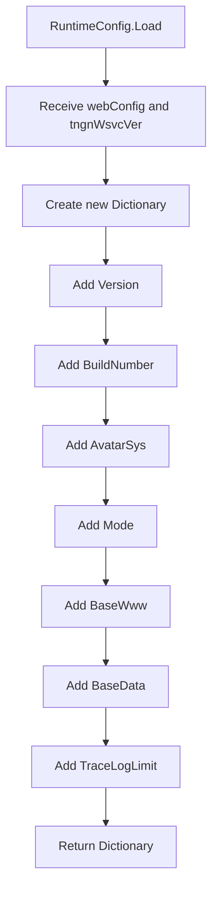

<!-- u250924 -->

[[🏠︎](../../README.md)] ❬ [Static documentation](../README.md) ❬ [Diagrams](README.md)

# TingenWebService

### CONTENTS
[TingenWebService.asmx.cs](#tingenwebserviceasmxcs)
[TingenWebService.Configuration.RuntimeConfig.cs](#tingenwebserviceconfigurationruntimeconfigcs)

***

## TingenWebService.asmx.cs

> Last updated 250924

## TingenWebService.Configuration.RuntimeConfig.cs

> Last updated 250924

***

[[🏠︎](../../README.md)] ❬ [Static documentation](../README.md) ❬ [Diagrams](README.md)
