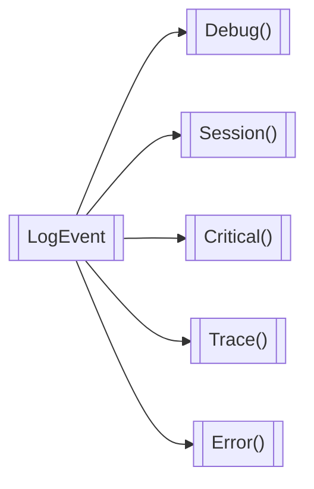

<!-- u251020 -->

<div align="center">

  <picture>
    <source media="(prefers-color-scheme: dark)" srcset="https://github.com/spectrum-health-systems/tingen-projects/blob/main/logos/tngndocs-dark-400x63.png">
    <source media="(prefers-color-scheme: light)" srcset="https://github.com/spectrum-health-systems/tingen-projects/blob/main/logos/tngndocs-light-400x63.png">
    
  </picture>
  <h1>Core.Logger</h1>
</div>

***

##### Content

* [LogEvent](#logevent)
  * [Debug](#logeventdebug)
  * [Session](#logeventsession)
  * [Critical](logeventcritical)
  * [Error](#error-logs)
  * [Trace](#trace-logs)

***

## LogEvent

Most log types start in the `LogEvent` class.



## LogEvent.Debug()

Debug logs:

* Are simple logs intended for temporary debugging
* Can be placed anywhere in the source code
* Are written to `C:\Tingen_Data\.development\debug\`
* Have a file name of `{ssff-fffff}-{ClassPath}-{MethodName}-{LineNumber}.debug`

Example:

```text
C:\Tingen_Data\.development\debug.1234-56789-DuJson-SerializeFile-42.debug
```

**Important!**  
 In order to ensure all debug logs are created, there is a 1ms delay before writing each file. Therefore, many debug logs may have a negative impact on performance.

### Syntax

To create a basic debug log:

```csharp
LogEvent.Debug()
```

You can also add a text message to the log content:

```csharp
LogEvent.Debug("This is a debug log.")
```

The log file will look like this:

```text
Tingen Web Service Debug Log
MM/DD/YYYY-HH:MM:SS
{message}
```

***

## LogEvent.Session()

TBD

***

## LogEvent.Critical()

Critical logs:

* Are used to alert users of a critical error or catastrophic failure
* Cannot be used until the logging functionality has been initialized
* Critical logs have a filename of `{LogTitle}-{AvatarUserName}.critical`
* Are written to both the *Session* folder, and the *AppData\Logs\Critical\* folder

Examples:

```text
`C:\Tingen_Data\WebService\LIVE\Session\250512\JSMITH\120133\Data does not exist-JSMITH.critical`
`C:\Tingen_Data\WebService\LIVE\AppData\Log\Data does not exist-JSMITH.critical`
```
**Important!**  
If you need to log something before the logging functionality is available, use a [debug log](#logeventdebug).

### Blueprints

Critical logs are built using a *blueprint* located at `C:\Tingen_Data\WebService\LIVE\AppData\www\Blueprint\Log\critical.blueprint`, which looks like this:

```text
===== CRITICAL LOG =================================== ~SESSION~DATE~TIME~ =====

~LOG~MESSAGE~

--------------------------------------------------------------------------------

[ASSEMBLY] ~ASSEMBLY~
   [CLASS] ~CLASS~
  [METHOD] ~METHOD~
    [LINE] ~LINE~

```

You can modify the layout of blueprint, as long as you use the `~PLACEHOLDER~NAMES~`.

### Syntax

To create a basic critical log:

```csharp
LogEvent.Critical(avatarUserName, sessionFolder, ExeAsm);
```

This will create a critical log with the name `C:\Tingen_Data\WebService\LIVE\Session\250512\JSMITH\120133\Unknown-JSMITH.critical`, and the contents would look like this:

```text
===== CRITICAL LOG ===================================== 05/12/25-12:01:33 =====

Unknown

--------------------------------------------------------------------------------

[ASSEMBLY] Outpost31
   [CLASS] Testing
  [METHOD] GenerateAppLogs
    [LINE] 87

```

#### Specifying a logTitle

To specify a logTitle:

```csharp
string logTitle = "Data does not exist";
LogEvent.Critical(avatarUserName, sessionFolder, ExeAsm, logTitle);
```

This will create a critical log with the name `C:\Tingen_Data\WebService\LIVE\Session\250512\JSMITH\120133\Data does not exist-JSMITH.critical`, which will have the same contents as the basic logfile above.

#### Specifying a logMessage

**IMPORTANT**  
If you specify a logMessage, you must also specify a logTitle.

To specify a logMessage:

```csharp
string logTitle   = "Data does not exist";
string logMessage = "We can't find the data!" +
                    Environment.Newline +
                    "Oh no!"
LogEvent.Critical(avatarUserName, sessionFolder, ExeAsm, logTitle, logMessage);
```

This will create a critical log with the name `C:\Tingen_Data\WebService\LIVE\Session\250512\JSMITH\120133\Data does not exist-JSMITH.critical`

And the file contents would look like this:

```text
===== CRITICAL LOG ===================================== 05/12/25-12:01:33 =====

We can't find the data!
Oh no!

--------------------------------------------------------------------------------

[ASSEMBLY] Outpost31
   [CLASS] Testing
  [METHOD] GenerateAppLogs
    [LINE] 87

```

***

<br>

<br>
<br>
<br>
<br>
<br>
<br>
<br>
<br>
<br>
<br>
<br>
<br>
<br>
<br>
<br>
<br>


# Error logs

**Error logs** are used to alert users of a any errors that occur, and cannot be used until the logging functionality has been initialized.

> If you need to log something before the logging functionality is available, use a [debug log](#debug-logs).

Error logs have a filename of `{ErrorCode}-{AvatarUserName}.error`, and are written to both the *Session* folder, and the *AppData\Logs\\* folder:

* `C:\Tingen_Data\WebService\{AvatarSystem}\Session\{YYMMDD}\{AvatarUserName}\{HHMMSS}`
* `C:\Tingen_Data\WebService\{AvatarSystem}\AppData\Log`

For example:
* `C:\Tingen_Data\WebService\LIVE\Session\250512\JSMITH\120133\E1234-JSMITH.critical`
* `C:\Tingen_Data\WebService\LIVE\AppData\Log\E1234-JSMITH.critical`

## The log blueprint

Error logs are built using a *blueprint* located at `C:\Tingen_Data\WebService\LIVE\AppData\www\Blueprint\Log\error.blueprint`, which looks like this:

```text
===== ERROR LOG ====================================== ~SESSION~DATE~TIME~ =====

~ERROR~CODE~

~ERROR~MESSAGE~

--------------------------------------------------------------------------------

[ASSEMBLY] ~ASSEMBLY~
   [CLASS] ~CLASS~
  [METHOD] ~METHOD~
    [LINE] ~LINE~

```

You can modify the layout of blueprint, as long as you use the `~PLACEHOLDER~NAMES~`.

## Basic version

To create a basic critical log:

```csharp
LogEvent.Critical(avatarUserName, sessionFolder, ExeAsm);
```

This will create a critical log with the name `C:\Tingen_Data\WebService\LIVE\Session\250512\JSMITH\120133\E###-JSMITH.error`, and the contents would look like this:

```text
===== ERROR LOG ======================================== 05/12/25-12:01:33 =====

E###

Unknown error.

--------------------------------------------------------------------------------

[ASSEMBLY] Outpost31
   [CLASS] Testing
  [METHOD] GenerateAppLogs
    [LINE] 103

```

## Specifying a ErrorCode

To specify a ErrorCode:

```csharp
string errorCode = "E1234";
LogEvent.Critical(avatarUserName, sessionFolder, ExeAsm, logTitle);
```

This will create a critical log with the name `C:\Tingen_Data\WebService\LIVE\Session\250512\JSMITH\120133\E1234-JSMITH.error`, and the contents would look like this:

```text
===== ERROR LOG ======================================== 05/12/25-12:01:33 =====

E1234

Unknown error.

--------------------------------------------------------------------------------

[ASSEMBLY] Outpost31
   [CLASS] Testing
  [METHOD] GenerateAppLogs
    [LINE] 103

```

## Specifying an ErrorMessage

> **Please note:** If you specify a ErrorMessage, you must also specify a ErrorCode.

To specify a logMessage:

```csharp
string errorCode    = "E1234";
string errorMessage = "There has been an error!" +
                      Environment.Newline +
                      "Oh no!"
LogEvent.Critical(avatarUserName, sessionFolder, ExeAsm, logTitle, logMessage);
```

This will create a critical log with the name `C:\Tingen_Data\WebService\LIVE\Session\250512\JSMITH\120133\E1234-JSMITH.error`

And the file contents would look like this:

```text
===== CRITICAL LOG ===================================== 05/12/25-12:01:33 =====

E1234

There has been an error!
Oh no!

--------------------------------------------------------------------------------

[ASSEMBLY] Outpost31
   [CLASS] Testing
  [METHOD] GenerateAppLogs
    [LINE] 87

```

***

<br>

# Trace logs

**Trace logs** are a specialized type of log, generally used during development, and cannot be used until the logging functionality has been initialized.

> If you need to log something before the logging functionality is available, use a [debug log](#debug-logs).
>
> Also, in order to ensure all trace logs are created, there is a 1ms delay before writing each file. Depending on what TraceLogLimit is set to, performance may be impacted.

Trace logs essentially create "breadcrumbs" in the form of log files, which let you know the flow of logic when the Tingen Web Service is used.

They are always written to `C:\Tingen_Data\WebService\{AvatarSystem}\Session\{YYMMDD}\{AvatarUserName}\{HHMMSS}` with a file name of `{ssfffffff}-{ExeAsm}-{ClassPath}-{MethodName}-{LineNumber}.debug`.

For example: `C:\Tingen_Data\WebService\LIVE\Session\250512\JSMITH\120133\004453498-Outpost31-AvatarScriptParameter-ParseRequest-43.trace`

## TraceLevel and TraceLogLimit

Each trace log statement contains a *TraceLevel* between `1` and `9`.

```csharp
LogEvent.Trace(0, traceLogLimit, sessionFolder, ExeAsm);
               ^
           TraceLevel
```

The Web.config file contains the TraceLogLimit, which is between `0` and `9`. The default value is `0`.

While every `LogEvent.Trace()` command is executed, only those whose *TraceLevel* is less than or equal to the *TraceLogLimit* are written.

For example, if the *TraceLogLimit* is set to `2`:

* `LogEvent.Trace(1, traceLogLimit, sessionFolder, ExeAsm)` will be written
* `LogEvent.Trace(5, traceLogLimit, sessionFolder, ExeAsm)` will not

Setting the *TraceLogLimit* to `0` disables all trace logs, since the *TraceLevel* cannot (or, really, *should* not) be `0`.

## Where to put trace logs

<!-- This needs to be more specific about what goes where. -->

### TraceLevel `0`

* All trace logs are disabled

### TraceLevel `1`

* At the top of all methods

#### Notes/exceptions

* Expression-body methods  
  If it makes sense to have a trace log in an expression-body method, convert it to a block-body method.

### TraceLevel `2`

* At the top of conditional statements that **do not** directly call another method.

#### Notes/exceptions

* TBD

### TraceLevel `3`

* At the top of conditional statements that *do* directly call another method.

#### Notes/exceptions

* Examples:
  - At the top of switch case statements

### TraceLevel `4`

* To test return statements in conditional statements
* To test operations like file deletion/creation in conditional statements

#### Notes/exceptions

* TBD

### TraceLevel `5`

* TBD

#### Notes/exceptions

* TBD

### TraceLevel `6`

* TBD

#### Notes/exceptions

* TBD

### TraceLevel `7`

* TBD

#### Notes/exceptions

* TBD

### TraceLevel `8`

* TBD

#### Notes/exceptions

* TBD

### TraceLevel `9`

* All trace logs are written

#### Notes/exceptions

* TBD


| `TraceLevel` | Description |
|:------------:|-----|
| `0` |  All trace logs are disabled |
| `1` |  At the top of each Method |
| `2` |  At the top of conditional statements that do not call another method |
| `3` |     |
| `4` |     |
| `5` |     |
| `6` |     |
| `7` |     |
| `8` |     |
| `9` |     |


* The **TraceLevel** is defined on a per-log basis, and the **TraceLogLimit** is defined in Web.config
* A trace log will be created if it has a *TraceLevel* that is less than the *TraceLogLimit*
* The traceLevel/traceLevelLimit is a number from **`1`** (default) to `9`
* Setting the TraceLogLimit to "0" will disable all trace logs
* Setting the TraceLogLimit to "9" will enable all trace logs

## Creating a trace log

To create a trace log file:

```csharp
LogEvent.Trace(TraceLevel, TraceLogLimit, SessionFolder, ExeAsm);
```

Assuming the *TraceLevel* is <= to the *TraceLogLimit*, a trace log will be created with the name `C:\Tingen_Data\WebService\LIVE\Session\250512\JSMITH\120133\E###-JSMITH.error`.

Trace logs do not have content.

***

<br>

