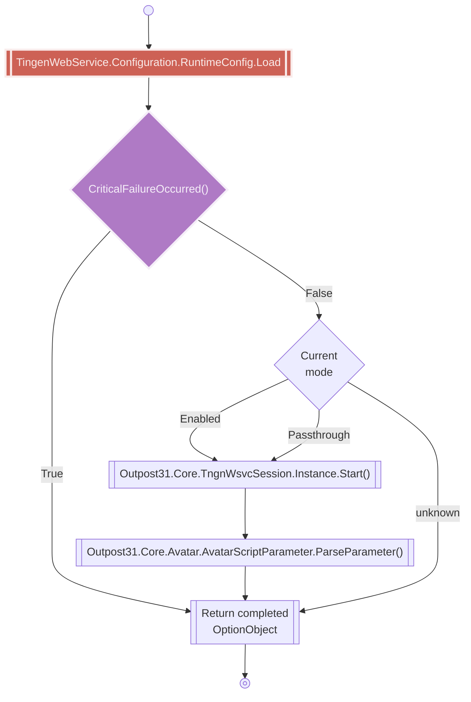

# TingenWebService.asmx.cs

## RunScript()

```mermaid
flowchart TB
    %% Components
    Start@{shape: sm-circ, label: "Start"}
    RuntimeConfig.Load@{shape: fr-rect, label: "TingenWebService.Configuration.RuntimeConfig.Load"}
    CriticalFailureOccurred@{shape: diam, label: "CriticalFailureOccurred()"}
    CurrentMode@{shape: diam, label: "Current\nmode"}
    Instance.Start@{shape: fr-rect, label: "Outpost31.Core.TngnWsvcSession.Instance.Start()"}
    ParseParameter@{shape: fr-rect, label: "Outpost31.Core.Avatar.AvatarScriptParameter.ParseParameter()"}
    ReturnOptionObject@{shape: fr-rect, label: "Return completed\nOptionObject"}
    Stop@{shape: fr-circ, label: "Release"}
    %% Layout
    Start --> RuntimeConfig.Load:::R2_ --> CriticalFailureOccurred:::P2_
    CriticalFailureOccurred --True--> ReturnOptionObject
    CriticalFailureOccurred --False--> CurrentMode
    CurrentMode:::G8
    CurrentMode --Enabled--> Instance.Start
    CurrentMode --Passthrough--> Instance.Start
    Instance.Start --> ParseParameter
    ParseParameter --> ReturnOptionObject
    CurrentMode --unknown --> ReturnOptionObject
    ReturnOptionObject -->  Stop
    %% Styles
    classDef R2_ stroke:#f9ebea,stroke-width:3px,fill:#CD6155,color:#f9ebea
    classDef P2_ stroke:#f5eef8,stroke-width:3px,fill:#af7ac5,color:#f5eef8
    classDef G8_ stroke:#145a32,stroke-width:3px,fill:#1d8348,color:#e9f7ef
```

```mermaid
flowchart LR
    %% Components
    Start@{shape: sm-circ, label: "Start"}
    RuntimeConfig.Load@{shape: fr-rect, label: "TingenWebService.Configuration.RuntimeConfig.Load"}
    CriticalFailureOccurred@{shape: diam, label: "CriticalFailureOccurred()"}
    CurrentMode@{shape: diam, label: "Current\nmode"}
    Instance.Start@{shape: fr-rect, label: "Outpost31.Core.TngnWsvcSession.Instance.Start()"}
    ParseParameter@{shape: fr-rect, label: "Outpost31.Core.Avatar.AvatarScriptParameter.ParseParameter()"}
    ReturnOptionObject@{shape: fr-rect, label: "Return completed\nOptionObject"}
    Stop@{shape: fr-circ, label: "Release"}
    %% Layout
    Start --> RuntimeConfig.Load:::R2_ --> CriticalFailureOccurred:::P2_
    CriticalFailureOccurred --True--> ReturnOptionObject
    CriticalFailureOccurred --False--> CurrentMode
    CurrentMode:::G8
    CurrentMode --Enabled--> Instance.Start
    CurrentMode --Passthrough--> Instance.Start
    Instance.Start --> ParseParameter
    ParseParameter --> ReturnOptionObject
    CurrentMode --unknown --> ReturnOptionObject
    ReturnOptionObject -->  Stop
    %% Styles
    classDef R2_ stroke:#f9ebea,stroke-width:3px,fill:#CD6155,color:#f9ebea
    classDef P2_ stroke:#f5eef8,stroke-width:3px,fill:#af7ac5,color:#f5eef8
    classDef G8_ stroke:#145a32,stroke-width:3px,fill:#1d8348,color:#e9f7ef
```