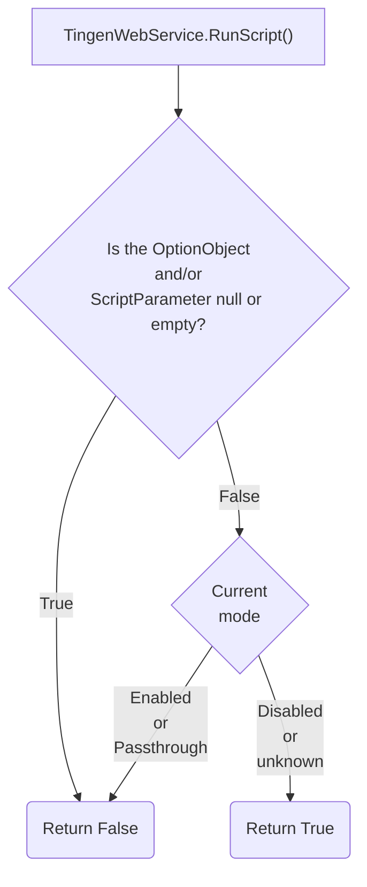
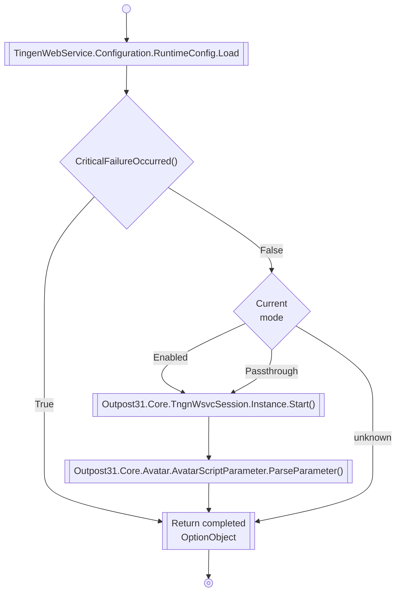
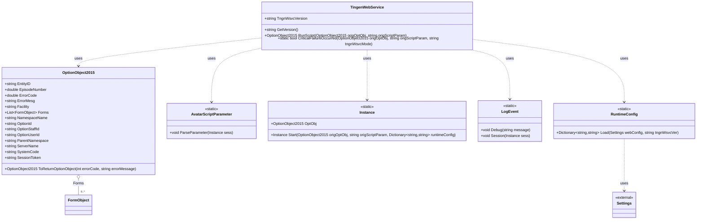

# TingenWebService.asmx.cs

## CriticalErrorOccurred()



## RunScript()






```mermaid
flowchart TD
    A[RunScript called] --> B[Load runtimeConfig]
    B --> C{CriticalFailureOccurred?}
    C -- Yes --> D[Return origOptObj.ToReturnOptionObject]
    C -- No --> E{Mode == "enabled" or "passthrough"?}
    E -- Yes --> F[Instance.Start]
    F --> G[AvatarScriptParameter.ParseParameter]
    G --> H[LogEvent.Session]
    H --> I[Return sess.OptObj.Completed]
    E -- No --> J[Return origOptObj.ToReturnOptionObject]
```