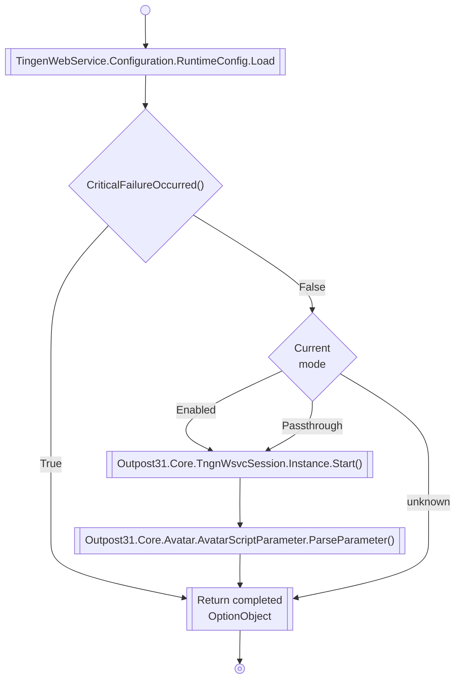

# TingenWebService.asmx.cs

## CriticalErrorOccurred()

```mermaid
flowchart TB
    %% Components
    RunScript@{shape: rect, label: "TingenWebService.RunScript()"}
    MissingData@{shape: diam, label: "Is the OptionObject and/or\nScriptParameter null or empty?}
    CurrentMode@{shape: diam, label: "Current\nmode"}
    ReturnTrue@{shape: rounded, label: "Return True"}
    ReturnFalse@{shape: rounded, label: "Return False"}
    %% Layout
    RunScript --> EmptyOptionObjectOrScriptParameter
    MissingData --True--> ReturnFalse
    MissingData --False--> CurrentMode
    CurrentMode --Enabled--> ReturnFalse
    CurrentMode --Passthrough--> ReturnFalse
    CurrentMode --Disabled--> ReturnTrue
    CurrentMode --unknown--> ReturnTrue
    %% Styles
```

## RunScript()

